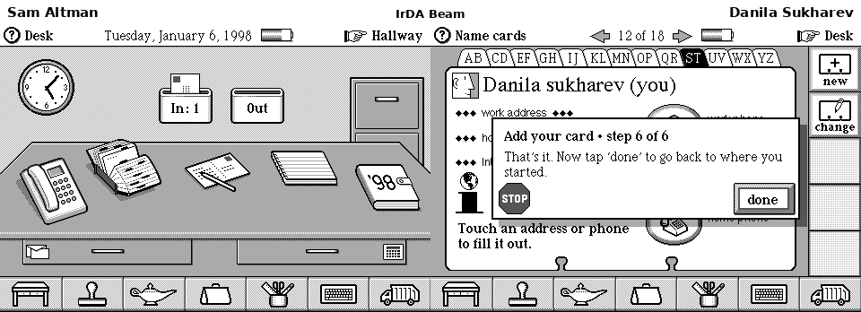

# DataRover 840 / Magic Cap Emulator

The first emulator for the
[General Magic DataRover 840](https://pdamuseum.eu/pda/datarover840/), a 1998
MIPS handheld running Magic Cap 3.1.

The emulator is a MAME driver, developed in the `custom` branch of
[ddanila/mame](https://github.com/ddanila/mame). This companion repository
contains the setup tools, automated regressions, and reverse-engineering
notes.


*Magic Cap 3.1 at its native 480×320 resolution. The tour is driven by a
deterministic touchscreen script; see
[how the demo is recorded](docs/demo.md).*

## Two DataRovers, one Beam, and one fax



Two real emulator instances discover each other over IrDA, transfer Sam's
name card, then connect their built-in software modems and send a two-page
fax. The invitation is explicitly marked as a parody for this historical
device. The complete scenario—including the native 2 bpp page, modem link,
checks, and GIF recording—is reproducible with
[`tools/paired_demo.py`](tools/paired_demo.py); see the
[recording notes](docs/demo.md#paired-beam-and-fax-demo).

## What works

The emulator boots the original DataRover 840 ROM into the interactive Magic
Cap workbench. Highlights include:

- touchscreen, persistent storage, suspend/wake, batteries, and sound;
- PC Cards, serial PCLink package installation, and IrDA beaming;
- the built-in telephone and fax paths, including two-emulator calls;
- networking through PC Card modem, EtherLink III, and the built-in modem;
- automated regressions for the implemented hardware and user workflows.

For the complete subsystem-by-subsystem status and known hardware boundaries,
see [`PLAN.md`](PLAN.md). For the machine's history and the project's
verification approach, see [`docs/background.md`](docs/background.md).

## Quick start

The setup guide has two explicit dependency tiers for macOS and
Debian/Ubuntu:

- [Build and run](docs/mame-bringup.md#1-build-and-run) — the short list for
  using the emulator.
- [Full development and verification](docs/mame-bringup.md#2-full-development-and-verification)
  — regression, networking, media, debugging, cross-binutils, Ghidra, and
  other analysis tools.

The short setup sequence is:

```sh
# 1. From any directory, clone this repo and the MAME fork side by side
git clone https://github.com/ddanila/magic-cap-emulator.git
git clone --branch custom https://github.com/ddanila/mame.git

# 2. Mirror and checksum-verify the research inputs (ROMs, packages, manuals).
#    They are copyrighted abandonware and are never committed to this repo;
#    the mirror defaults to a magic-cap-assets directory next to the clones.
cd magic-cap-emulator
tools/fetch_assets.sh all

# 3. Build only the DataRover driver (much faster than a full MAME build)
cd ../mame
PATH="/usr/lib/ccache:$PATH" \
  make SUBTARGET=datarover \
  SOURCES=src/mame/skeleton/datarover.cpp \
  REGENIE=1 \
  NO_USE_PORTAUDIO=1 \
  -j"$(nproc)"

# 4. Play
cd ../magic-cap-emulator
tools/start_manual.sh
```

## First boot

At the welcome screen, click the display, then click the three calibration
targets: upper-left, lower-right, and center. This opens the Magic Cap
workbench. **End** is the power button.

By default, the tools expect the MAME fork at `../mame` and keep ROMs,
persistent state, and generated artifacts in `../magic-cap-assets`. Both
locations are configurable; see the
[full setup guide](docs/mame-bringup.md).

## Documentation

Start with:

- [Project background](docs/background.md) — the hardware, ROM, history, and
  verification philosophy.
- [Setup and verification](docs/mame-bringup.md) — prerequisites, building,
  running, and the regression suite.
- [Status and plan](PLAN.md) — detailed implementation coverage and known
  boundaries.
- [User-guide coverage](docs/user-guide.md) — product workflows exercised by
  the emulator.

Technical deep dives:

- **Core hardware:** [ROM layout](docs/rom-layout.md),
  [memory map and Magic Bus](docs/memory-map.md),
  [Betty ASIC](docs/betty-registers.md), [TX39 CPU](docs/tx39-cpu.md), and
  [power management](docs/power-wake.md).
- **Connectivity:** [PCLink](docs/pclink.md), [IrDA](docs/irda.md),
  [PC Card modem](docs/modem.md), [built-in modem](docs/builtin-modem.md),
  [EtherLink III](docs/etherlink.md), and
  [TLS browsing](docs/oldvcr-tls.md).
- **Research and development:** [developer archives](docs/developer-archives.md),
  [development ROMs](docs/dev-rom.md), and
  [local analysis tooling](docs/local-tooling-handoff.md).

## Repo layout

```
docs/       RE notes and acceptance maps
docs/media/ the committed README animations and their source media
tools/      automated regression harnesses and analysis scripts
tests/      unit tests for the tools, with captured serial fixtures
roms/       optional git-ignored compatibility path; persistent assets live in the sibling asset tree
```

Driver development happens in the MAME fork at
[ddanila/mame](https://github.com/ddanila/mame) (cloned as a sibling of this
repo, `../mame`, work happens on the `custom` branch, never on `master`);
this repo tracks notes, tools, and tests.

## License

MIT — see [`LICENSE.md`](LICENSE.md). MAME driver code follows MAME's
licensing; ROM images remain © General Magic and are not distributed here.
