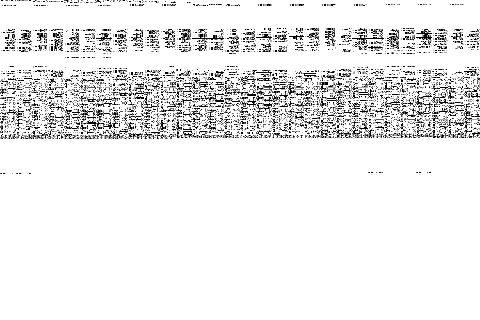

# DataRover 840 / Magic Cap Emulator

The first emulator for the [General Magic DataRover 840](https://pdamuseum.eu/pda/datarover840/)
— the last and best Magic Cap communicator (1998), running Magic Cap 3.1 on a
MIPS CPU. The emulator is built as a MAME driver (fork:
[ddanila/mame](https://github.com/ddanila/mame), `custom` branch); this
repository holds the reverse-engineering notes, analysis tooling, and
regression harnesses.



*A real recording of the emulated machine at its native 480×320, driven by a
deterministic touchscreen script: boot → desk → Stamps → Hallway → the
painting → Downtown → the Internet Center → Internet Mail rules. Static scenes
are shortened; the animations play at their recorded speed. How it is made:
[`docs/demo.md`](docs/demo.md).*

The emulated machine boots ROM build 3.1.2j to the interactive Magic Cap
workbench: touchscreen, persistent storage and suspend/wake, speaker output,
live AC charging with LCD/Magic Bus power-rail effects and configurable
automatic shutoff, both PC Card slots, package installation over serial PCLink,
IrDA beaming
between two emulated communicators, Web Browser 4.0 fetching local HTTP over
both live PC Card PPP and the original EtherLink III driver, and deterministic
native `https://` dispatch through Web Browser 3.5's TLS proxy Rule and Crypto
Ancienne all work, each covered by an automated regression. Blank, formatted,
and authentic Simulator 1.x storage cards are also recognized; full
built-in-storage backup/restore passes, and `Translation.pkg` copies a real
1.x `new items` package into 3.1 Built-in storage without changing its source. A
guarded loopback launcher also lets that corrected browser visit public HTTPS
sites; see
[the live-browsing instructions](docs/oldvcr-tls.md#browsing-the-live-web).
The full status table and roadmap are in [`PLAN.md`](PLAN.md); the machine's
hardware, history, and verification approach are in
[`docs/background.md`](docs/background.md).

## Installation

Full host prerequisites (macOS and Debian/Ubuntu package lists) and every
regression command are in [`docs/mame-bringup.md`](docs/mame-bringup.md).
The short version:

```sh
# 1. From any directory, clone this repo and the MAME fork side by side
git clone https://github.com/ddanila/magic-cap-emulator.git
git clone --branch custom https://github.com/ddanila/mame.git

# 2. Mirror and checksum-verify the research inputs (ROMs, packages, manuals).
#    They are copyrighted abandonware and are never committed to this repo;
#    the mirror defaults to a magic-cap-assets directory next to the clones.
cd magic-cap-emulator
tools/fetch_assets.sh all

# 3. Build only the DataRover driver (much faster than a full MAME build)
cd ../mame
PATH="/usr/lib/ccache:$PATH" \
  make SUBTARGET=datarover \
  SOURCES=src/mame/skeleton/datarover.cpp \
  REGENIE=1 \
  NO_USE_PORTAUDIO=1 \
  -j"$(nproc)"

# 4. Play
cd ../magic-cap-emulator
tools/start_manual.sh
```

At the welcome screen, touch it, then tap the three calibration targets
(upper-left, lower-right, center) to reach the workbench. **End** is the
power button.

Nothing depends on where you keep the checkouts. The tools locate this repo
from their own path, expect the MAME fork as a sibling (`../mame`; override
per tool with `--mame`, or `MAME_DIR` for `start_manual.sh`), and keep every
persistent input and generated artifact in the sibling `../magic-cap-assets`
tree — set the `MAGIC_CAP_ASSETS` environment variable to move it anywhere
else. Command examples in `docs/` assume the repository root as the working
directory and write the asset tree as `$MAGIC_CAP_ASSETS`.

## Documentation

| Doc | Contents |
|---|---|
| [`background.md`](docs/background.md) | The machine, the ROM, prior art, simulators, resources, verification philosophy |
| [`developer-archives.md`](docs/developer-archives.md) | Public developer sources, adopted evidence, checksums and roadmap impact |
| [`mame-bringup.md`](docs/mame-bringup.md) | Host setup, build, run, and the full regression suite |
| [`rom-layout.md`](docs/rom-layout.md) | ROM/SDK provenance, checksums, asset mirror, image format |
| [`memory-map.md`](docs/memory-map.md) | Memory map, Dino peripheral block, Magic Bus, Glacier |
| [`betty-registers.md`](docs/betty-registers.md) | Betty SIB ASIC registers, sound and telecom DMA |
| [`tx39-cpu.md`](docs/tx39-cpu.md) | TX39/R3900 CPU audit and the `MADD`/`MADDU` extension |
| [`power-wake.md`](docs/power-wake.md) | Power, sleep/wake path, batteries, AC and cover inputs |
| [`pclink.md`](docs/pclink.md) | Recovered PCLink wire format and package-install regression |
| [`modem.md`](docs/modem.md) | PC Card modem, Slirp PPP, Web Browser 4.0 acceptance |
| [`builtin-modem.md`](docs/builtin-modem.md) | Built-in software modem and V.32 DSP boundary |
| [`etherlink.md`](docs/etherlink.md) | 3Com 3C589 PC Card and HTTP over the original driver |
| [`oldvcr-tls.md`](docs/oldvcr-tls.md) | Kaiser's field report and the proxy-assisted TLS regression |
| [`irda.md`](docs/irda.md) | IrDA SIR transport and the two-machine Beam regression |
| [`dev-rom.md`](docs/dev-rom.md) | 1998 development ROMs and the OS's own test suites |
| [`user-guide.md`](docs/user-guide.md) | Product-guide acceptance map and coverage matrix |
| [`demo.md`](docs/demo.md) | Recording the README animation |

## Repo layout

```
docs/       RE notes and acceptance maps
docs/media/ the README animation (the only committed recording)
tools/      automated regression harnesses and analysis scripts
tests/      unit tests for the tools, with captured serial fixtures
roms/       optional git-ignored compatibility path; persistent assets live in the sibling asset tree
```

Driver development happens in the MAME fork at
[ddanila/mame](https://github.com/ddanila/mame) (cloned as a sibling of this
repo, `../mame`, work happens on the `custom` branch, never on `master`);
this repo tracks notes, tools, and tests.

## License

MIT — see [`LICENSE.md`](LICENSE.md). MAME driver code follows MAME's
licensing; ROM images remain © General Magic and are not distributed here.
